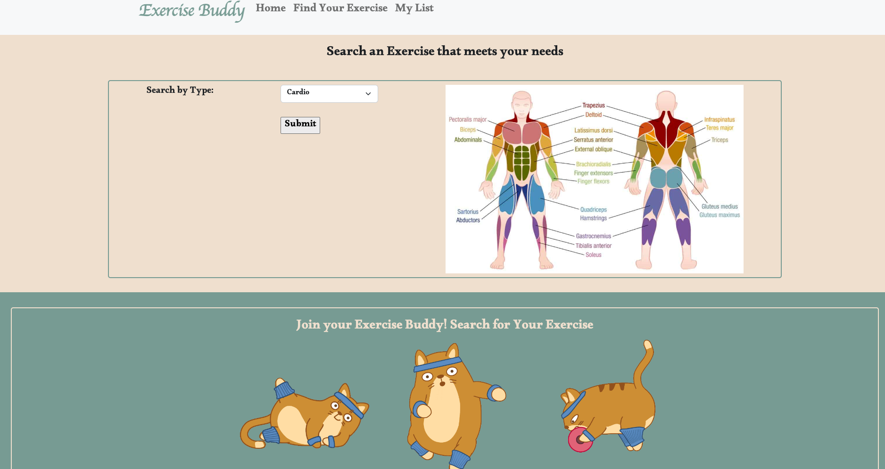
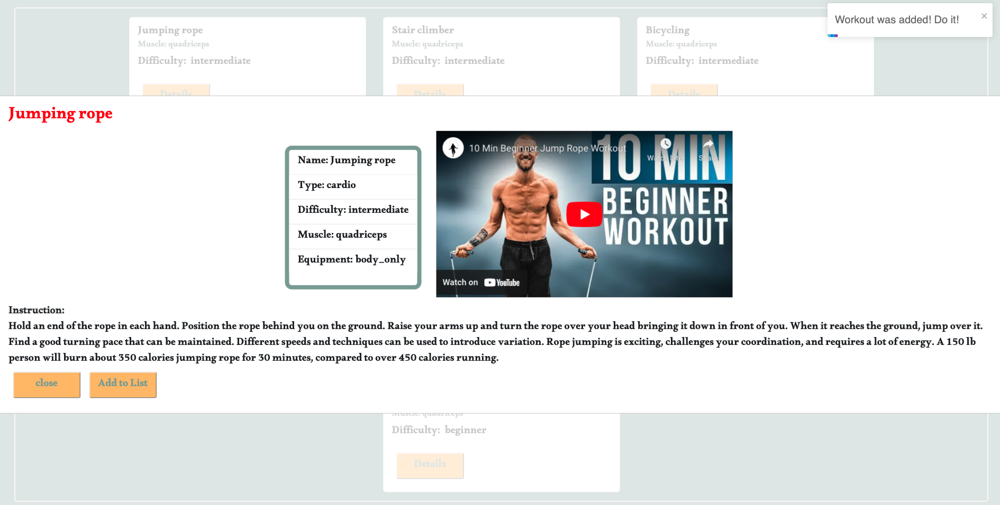
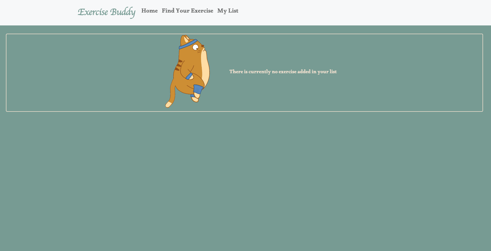
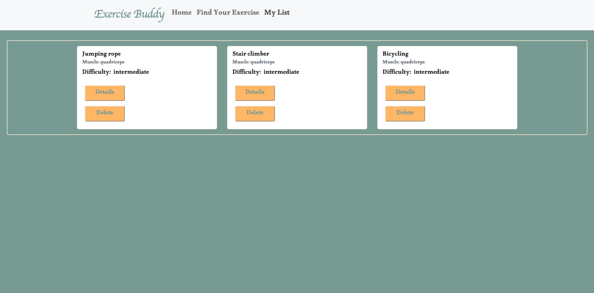

# Exercise Buddy

## About the project

"Exercise Buddy" is a website used for people to look up different exercises based on types of exercises. With this app, users can search various types of exercises such as cardio, strength, stretching and more. Each exercise comes with detailed information including a name of the exercise, the muscle part that is trained, difficulty level, possible equipment that is needed and an instruction on how to do the exercise with a video. Users can add the exercise they like into My List. 

### Tech Stack

* Javascript
* React
* Redux
* NPM 
* Restful API
* Google API
* HTML
* CSS
* Bootstrap

### Screenshots of the webpage:

### Challenge

* The initial fetch for the exercise data required redux-thunk. The fetch was also initially done in exercise component when users submit the choice of the exercise type. To avoid calling API fetch each time when users submit a type request, the exercise fetching action was triggered in the homepage once the web page is loaded.
* When fetching the Youtube video, the video ID needed to be converted into the iframe format and then stored it into hook by using useState. A variable cannot be inserted into iframe but using useState can make it happen. 

### Author

**Manjuan He**

- [Portfolio](https://manjuanhe.com)
- [GitHub](https://github.com/Joyhecoder)

